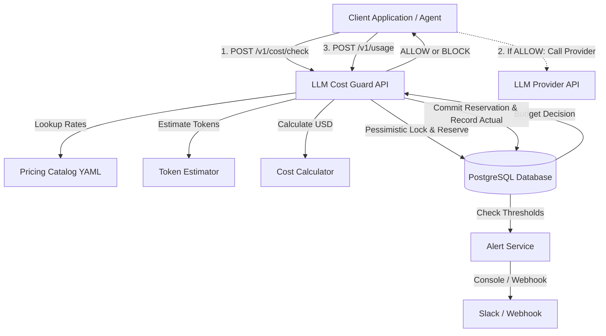

# Architecture & Design Decisions

LLM Cost Guard is designed as a high-throughput, concurrency-safe financial control plane positioned between client applications and downstream LLM API providers (OpenAI, Anthropic, Google Gemini, DeepSeek).

---

## 1. System Overview

---

## 2. Request Lifecycle & Concurrency Strategy

A core failure mode in production LLM cost control is the **concurrency race condition**: two requests arriving simultaneously against a tight remaining budget (e.g. \$0.30 remaining, two requests needing \$0.25 each). Without concurrency controls, both requests would read \$0.30 remaining and both would be approved, resulting in a \$0.20 budget overrun (\$0.50 spent).

### Concurrency Consistency Strategy

LLM Cost Guard enforces consistency using a dual-layer strategy:

1. **Pessimistic Row Locking (`SELECT ... FOR UPDATE`)**:
   During the `POST /v1/cost/check` transaction, the system acquires a row lock on the target `budget_configs` row (`with_for_update()`). This serializes concurrent balance checks for the same scope (e.g., `user:xyz` or `global`).

2. **Atomic Budget Reservations (`budget_reservations`)**:
   When `reserve=True` is supplied to `POST /v1/cost/check`, the system inserts an active reservation record with a short TTL (e.g. 60 seconds):
   - **In-flight spend** = `sum(recorded_usage) + sum(active_reservations)`
   - The second concurrent request evaluates `spent + reservation + estimated_cost`. Because the first request's reservation is already counted, the second request is immediately **BLOCKED** with `REQUEST_EXCEEDS_DAILY_BUDGET`.
   - When the LLM provider responds, the caller submits `POST /v1/usage` containing `reservation_id`. The reservation is marked `COMMITTED`, and the actual usage is logged in a single transaction.
   - If a request crashes or times out before calling `/v1/usage`, the reservation expires automatically upon reaching `expires_at`, releasing the held budget without requiring manual cleanup.

### Consistency Guarantee Disclosures
- **Single-Node PostgreSQL / Cluster**: Fully ACID compliant and serialized via row-level locks.
- **Distributed Multi-Region**: If deployed across multiple isolated database clusters, distributed consensus (e.g., Redis Redlock or distributed 2PC) would be required. This system explicitly uses PostgreSQL transactional locking rather than making unverified distributed consensus claims.

---

## 3. Separation of Responsibilities

The codebase strictly enforces separation of concerns:

| Component | Responsibility |
| :--- | :--- |
| `TokenEstimator` | Converts raw text and chat message arrays into token counts. Strictly separates token counting from pricing. |
| `PricingCatalog` | Parses and validates `pricing.yaml`. Handles versioning, effective dates, and model lookups. |
| `CostCalculator` | Performs precise monetary calculations using Python `Decimal` arithmetic to avoid floating-point drift. |
| `BudgetService` | Calculates period spend (daily, weekly, monthly) in UTC, evaluates limits, and manages reservations. |
| `AlertService` | Tracks threshold crossings (80%, 90%, 100%), persists events, prevents duplicate alerts, and dispatches webhooks. |
| `AnalyticsService` | Aggregates database usage logs for reporting, charts, and dashboard views. |

---

## 4. Database Schema & Indexing

All models inherit from SQLAlchemy 2.0 `DeclarativeBase` with type-safe `Mapped` columns.

### `llm_usage_logs`
- **Primary Key**: `id` (UUID v4 string)
- **Indexes**:
  - `(user_id, timestamp)`: Optimized for per-user spending queries over time windows.
  - `(model, timestamp)`: Optimized for model-specific cost breakdown.
  - `(endpoint, timestamp)`: Optimized for route-level cost analytics.
  - `request_id`: For fast client trace lookups.

### `budget_configs`
- **Unique Index**: `scope` (e.g. `global`, `user:team_alpha`, `endpoint:/v1/chat`)
- **Fields**: `daily_budget`, `weekly_budget`, `monthly_budget`, `alert_thresholds` (JSON), `is_active`.

### `budget_reservations`
- **Index**: `(scope, status, expires_at)`: Optimized for querying active, non-expired reservations.

### `alert_events`
- **Unique Constraint**: `(scope, period_type, period_start, threshold)`: Guarantees that a threshold alert is emitted at most once per period window.
